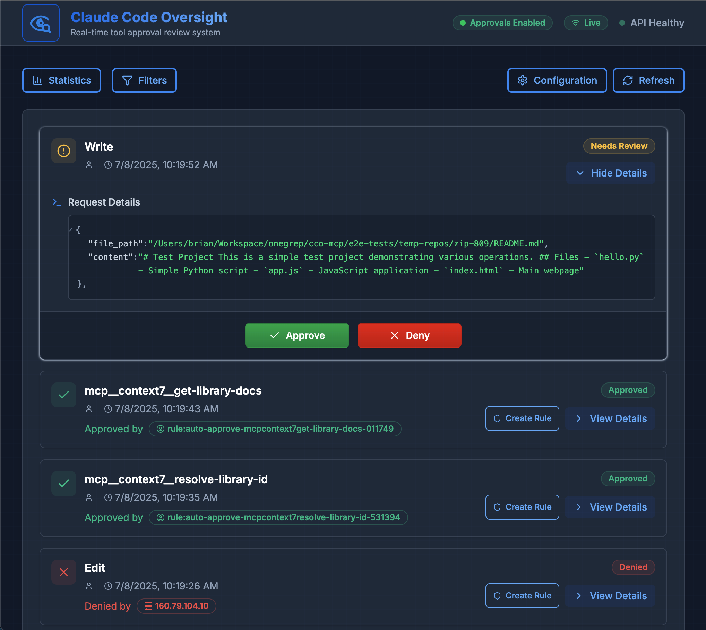

[](https://mseep.ai/app/toolprint-cco-mcp)

# CCO-MCP (Claude Code Oversight)

Real-time audit and approval system for Claude Code tool calls. Get instant visibility and control over AI agent actions with a sleek web dashboard.



## Overview

CCO-MCP provides a security layer between Claude Code and your system, enabling you to monitor and control AI tool calls in real-time. It acts as a firewall for AI actions, allowing you to review sensitive operations before they execute while auto-approving safe ones based on configurable rules.  This let's you scale to many more non-interactive Claude Code instances running in the background without incurring "tab-switching fatigue".

## Get Started

### Clone and run with Docker Compose

```bash
git clone https://github.com/onegrep/cco-mcp.git
cd cco-mcp
docker-compose up
```

### Configure Claude Code

Install CCO-MCP at the user scope:

```bash
claude mcp add -s user -t http cco-mcp http://localhost:8660/mcp
```

This will add the following to your Claude Code config:

```json
{
  "mcpServers": {
    "cco-mcp": {
      "type": "http",
      "url": "http://localhost:8660/mcp"
    }
  }
}
```

For self-hosted deployments, replace `http://localhost:8660/mcp` with your deployment URL.

Visit http://localhost:8660 to access the dashboard.

### Enable Approval Prompts

To use CCO-MCP for approval prompts, run Claude Code in non-interactive mode with the appropriate [Permission Prompt Tool](https://docs.anthropic.com/en/docs/claude-code/sdk#custom-permission-prompt-tool) flag:

```bash
claude code -p "your prompt here" --permission-prompt-tool mcp__cco-mcp__approval_prompt
```

This enables Claude to request approval through CCO-MCP before executing sensitive operations without using the "dangerously skip permissions" option.

## Main Features

### 🛡️ Smart Approval Rules
Create rules to auto-approve safe operations (like file reads) while requiring manual approval for sensitive ones (like running bash commands).

### 📊 Real-Time Dashboard
Monitor all tool calls as they happen with live updates via Server-Sent Events.

### 🔍 Detailed Audit Logs
Every tool call is logged with full context including agent identity, parameters, and approval status.

## Configuration Options

All configuration can be managed through the web interface at http://localhost:8660/config.

### Default Action and Timeouts

- **Default Action**: Choose whether unmatched requests are automatically approved or require manual review
- **Auto-Deny Timeout**: Set how long to wait for manual approval before automatically denying (default: 5 minutes)
- **Entry TTL**: Configure how long audit log entries are retained (default: 24 hours)

### Approval Rules

Rules use a priority system (lower numbers = higher priority) to determine actions:

- **Tool Matching**: Match specific tools (built-in like Read/Write or MCP server tools)
- **Agent Matching**: Create rules for specific agent identities
- **Pattern Matching**: Use wildcards for flexible rule creation
- **Actions**: Set rules to auto-approve or auto-deny matching requests

### Environment Variables

- `PORT` - Server port (default: 8660)
- `CCO_CONFIG_PATH` - Config file location (default: ~/.cco-mcp/config.json)

## Development

### Project Structure

```
cco-mcp/
├── src/              # TypeScript backend
│   ├── audit/        # Core audit service
│   ├── routes/       # REST API endpoints
│   └── server.ts     # MCP server
├── ui/               # React frontend
│   └── src/
│       ├── components/
│       └── pages/
└── dist/             # Build output
```

### Design Principles

- **Simplicity first** - Enabling core use-case of approving background agents
- **Real-time by default** - SSE for instant updates
- **Type safety** - Full TypeScript coverage
- **User-friendly** - Intuitive UI with helpful defaults

### Local Development

```bash
# Install required tools
just brew

# Setup project dependencies
just setup

# Run both backend and UI
just dev-all

# Run tests
just test

# Format code
just format

# Build everything
just build-all
```

## Contributing

We welcome contributions! Please see our [Contributing Guide](CONTRIBUTING.md) for details.

## License

MIT License - Copyright 2025 OneGrep, Inc.

## Acknowledgments

Built for use with [Claude Code](https://claude.ai/code) and the [Model Context Protocol](https://modelcontextprotocol.io) by Anthropic.