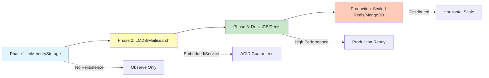
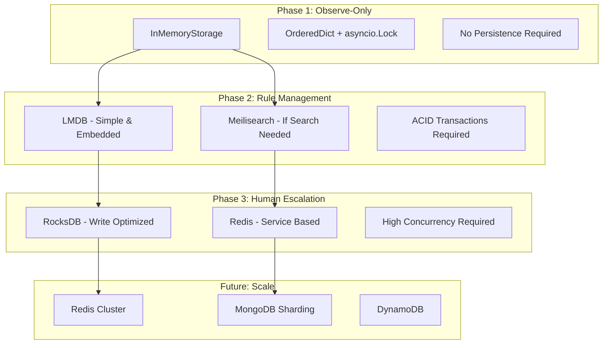

# Persistence Strategy Revision: From SQL to Document Store

## Executive Summary

After analyzing the data model and requirements, we're revising the persistence strategy from SQL-based storage to a document-oriented approach. This decision is based on the fundamental observation that **our system has zero relational requirements** - no JOINs, no foreign keys, and no complex transactions across entities.

## Data Model Analysis

### What We're Actually Storing

1. **Audit Entries** (Primary Entity)
   ```python
   {
       "id": "uuid",
       "timestamp": "2024-01-01T00:00:00Z",
       "tool_name": "Bash",
       "tool_input": {...},  # Embedded JSON
       "decision": {         # Embedded document
           "action": "allow",
           "reason": "...",
           "metadata": {...}
       },
       "state": "completed",
       "rule_id": "rule-123",  # Simple reference, not a FK
       "rule_name": "auto-approve-reads"
   }
   ```

2. **Rules** (Configuration)
   - Already stored as YAML/JSON documents
   - No relationships to other entities
   - Self-contained configuration objects

3. **Hook Events** (From Claude Code)
   - Already in document format
   - No normalization needed
   - Natural JSON structure

4. **Pending Reviews** (Temporary State)
   - Short-lived (TTL-based)
   - No persistent relationships
   - Perfect for in-memory cache

### Why NOT Relational Database?

| Aspect | Relational Need | Our System | Conclusion |
|--------|----------------|------------|------------|
| JOINs | Complex queries across tables | Zero JOINs found | ❌ Not needed |
| Foreign Keys | Referential integrity | No FK constraints | ❌ Not needed |
| Transactions | ACID across tables | Only document-level | ❌ Not needed |
| Normalization | Reduce redundancy | Self-contained docs | ❌ Not needed |
| Schema | Rigid structure | Flexible JSON | ❌ Hindrance |

### The ORM Anti-Pattern

Using an ORM for document-oriented data creates unnecessary complexity:

```python
# What we DON'T want (ORM approach)
class AuditEntry(Base):
    __tablename__ = 'audit_entries'
    id = Column(String, primary_key=True)
    decision_id = Column(String, ForeignKey('decisions.id'))
    decision = relationship("Decision", back_populates="audit_entry")
    # Complex session management, lazy loading, N+1 problems...

# What we DO want (Document approach)
entry = AuditEntry(
    id="uuid",
    decision=Decision(action="allow", reason="..."),  # Embedded
    # Simple, self-contained, no session management
)
await storage.save(entry)  # Done!
```

## Proposed Storage Evolution

### Phase 1: Pure In-Memory (Observe-Only Mode)

```python
class InMemoryAuditStorage:
    """Simplest possible storage for observe-only mode"""
    
    def __init__(self, max_entries: int = 10000):
        self.entries = OrderedDict()  # Preserves order, O(1) access
        self.max_entries = max_entries
        self._lock = asyncio.Lock()
    
    async def add_entry(self, entry: AuditEntry) -> None:
        async with self._lock:
            if len(self.entries) >= self.max_entries:
                self.entries.popitem(last=False)  # FIFO eviction
            self.entries[entry.id] = entry
    
    async def query_entries(self, **filters) -> List[AuditEntry]:
        # Simple in-memory filtering
        results = []
        for entry in self.entries.values():
            if self._matches_filters(entry, filters):
                results.append(entry)
        return results
```

**Benefits:**
- Zero dependencies
- Fast development/testing
- No persistence overhead for observe-only
- Natural Python data structures

### Phase 2: Document Persistence with ACID Guarantees

#### Option A: Direct LMDB (Recommended for Phase 2)

```python
import lmdb
import json
import asyncio
from typing import Optional, List, Dict, Any
from collections import OrderedDict

class LMDBAuditStorage:
    """LMDB-based document storage with ACID transactions"""
    
    def __init__(self, db_path: str = "./audit.lmdb", map_size: int = 10 * 1024 * 1024 * 1024):  # 10GB
        self.env = lmdb.open(db_path, map_size=map_size, max_dbs=3)
        self.audit_db = self.env.open_db(b'audit_entries')
        self.rules_db = self.env.open_db(b'rules')
        self.pending_db = self.env.open_db(b'pending_reviews')
        
        # LMDB automatically serializes writes, but we still use locks for complex operations
        self._operation_locks = {}  # For document-level operations
        self._lock_creation_lock = asyncio.Lock()
    
    async def add_entry(self, entry: AuditEntry) -> None:
        """Add audit entry with automatic write serialization"""
        # LMDB handles concurrent writes by queuing them
        with self.env.begin(write=True) as txn:
            key = entry.id.encode('utf-8')
            value = json.dumps(entry.model_dump()).encode('utf-8')
            txn.put(key, value, db=self.audit_db)
    
    async def update_entry_atomic(self, entry_id: str, updates: Dict[str, Any]) -> bool:
        """Atomic update with version checking"""
        # Get or create document-level lock
        async with self._lock_creation_lock:
            if entry_id not in self._operation_locks:
                self._operation_locks[entry_id] = asyncio.Lock()
            lock = self._operation_locks[entry_id]
        
        async with lock:
            with self.env.begin(write=True) as txn:
                key = entry_id.encode('utf-8')
                
                # Read current value
                current_bytes = txn.get(key, db=self.audit_db)
                if not current_bytes:
                    return False
                
                current = json.loads(current_bytes.decode('utf-8'))
                
                # Check version for optimistic locking
                if 'version' in updates and current.get('version', 0) != updates['version'] - 1:
                    return False
                
                # Apply updates
                current.update(updates)
                current['version'] = current.get('version', 0) + 1
                
                # Write back atomically
                value = json.dumps(current).encode('utf-8')
                txn.put(key, value, db=self.audit_db)
                return True
    
    async def query_entries(self, **filters) -> List[Dict[str, Any]]:
        """Query entries with filters - readers don't block writers"""
        results = []
        with self.env.begin() as txn:
            cursor = txn.cursor(db=self.audit_db)
            for key, value in cursor:
                entry = json.loads(value.decode('utf-8'))
                if self._matches_filters(entry, filters):
                    results.append(entry)
        return results
```

**Benefits:**
- **True ACID transactions** with single-writer/multi-reader architecture
- **Automatic write serialization** - no data corruption possible
- **Memory-mapped performance** - reads directly from memory
- **No external dependencies** - embedded database
- **Handles concurrency properly** - LMDB queues concurrent writes automatically
- **Tested at scale** - used by OpenLDAP, proven in production

**Limitations:**
- Single writer at a time (but automatically queued, not blocked)
- Database size must be pre-allocated (can be resized)
- No built-in search capabilities (just key-value)

#### Option B: Meilisearch (LMDB-Powered Search Engine)

```python
import meilisearch
import asyncio
from typing import Optional, List, Dict, Any
from datetime import datetime

class MeilisearchAuditStorage:
    """Meilisearch-based storage with full-text search capabilities"""
    
    def __init__(self, url: str = "http://localhost:7700", api_key: Optional[str] = None):
        self.client = meilisearch.Client(url, api_key)
        
        # Create indexes if they don't exist
        self._setup_indexes()
        
        # Document-level locks for complex operations
        self._operation_locks = {}
        self._lock_creation_lock = asyncio.Lock()
    
    def _setup_indexes(self):
        """Setup indexes with appropriate settings"""
        # Audit entries index
        try:
            self.audit_index = self.client.index('audit_entries')
        except:
            self.client.create_index('audit_entries', {'primaryKey': 'id'})
            self.audit_index = self.client.index('audit_entries')
            
            # Configure searchable attributes (only what we need to search)
            self.audit_index.update_searchable_attributes([
                'tool_name',
                'decision.action',
                'decision.reason',
                'state'
            ])
            
            # Configure filterable attributes for faceting
            self.audit_index.update_filterable_attributes([
                'timestamp',
                'state',
                'decision.action',
                'tool_name'
            ])
    
    async def add_entry(self, entry: AuditEntry) -> None:
        """Add audit entry with automatic indexing"""
        # Meilisearch handles concurrent writes internally
        document = entry.model_dump()
        document['timestamp'] = int(datetime.fromisoformat(document['timestamp']).timestamp())
        
        # Add document (async operation)
        task = self.audit_index.add_documents([document])
        
        # Wait for indexing to complete (optional)
        self.client.wait_for_task(task['taskUid'])
    
    async def update_entry_atomic(self, entry_id: str, updates: Dict[str, Any]) -> bool:
        """Atomic update with document-level locking"""
        # Get or create document-level lock
        async with self._lock_creation_lock:
            if entry_id not in self._operation_locks:
                self._operation_locks[entry_id] = asyncio.Lock()
            lock = self._operation_locks[entry_id]
        
        async with lock:
            # Get current document
            try:
                current = self.audit_index.get_document(entry_id)
            except:
                return False
            
            # Check version for optimistic locking
            if 'version' in updates and current.get('version', 0) != updates['version'] - 1:
                return False
            
            # Apply updates
            current.update(updates)
            current['version'] = current.get('version', 0) + 1
            
            # Update document
            task = self.audit_index.update_documents([current])
            self.client.wait_for_task(task['taskUid'])
            return True
    
    async def query_entries(self, search: Optional[str] = None, **filters) -> Dict[str, Any]:
        """Query with full-text search and filtering"""
        search_params = {
            'limit': filters.get('limit', 100),
            'offset': filters.get('offset', 0)
        }
        
        # Build filter expressions
        filter_exprs = []
        if 'state' in filters:
            filter_exprs.append(f"state = '{filters['state']}'")
        if 'tool_name' in filters:
            filter_exprs.append(f"tool_name = '{filters['tool_name']}'")
        if 'from_timestamp' in filters:
            filter_exprs.append(f"timestamp >= {filters['from_timestamp']}")
        
        if filter_exprs:
            search_params['filter'] = ' AND '.join(filter_exprs)
        
        # Perform search
        results = self.audit_index.search(
            search or '',  # Empty string searches all
            search_params
        )
        
        return {
            'entries': results['hits'],
            'total': results['estimatedTotalHits'],
            'offset': results['offset'],
            'limit': results['limit']
        }
```

**Benefits:**
- **Full-text search** with typo tolerance built-in
- **Faceting and filtering** for complex queries
- **REST API** with multiple language SDKs
- **Built on LMDB** for reliability and performance
- **Automatic indexing** with configurable attributes
- **Real-time search** as documents are indexed
- **Built-in pagination** and result ranking

**Limitations:**
- External service to run (not embedded)
- Higher resource usage due to search indexing
- Disk space grows without reclaiming (LMDB characteristic)
- Overkill if you don't need search features

### Phase 3: Production-Grade Storage with High Concurrency

#### Option A: RocksDB (Embedded High-Performance)

```python
import rocksdb
import json
import asyncio
from typing import Optional, List, Dict, Any
from pydantic import BaseModel

class RocksDBStorage:
    """RocksDB-based storage optimized for write-intensive workloads"""
    
    def __init__(self, db_path: str = "./audit.rocks"):
        # Configure for optimal performance
        opts = rocksdb.Options()
        opts.create_if_missing = True
        opts.max_open_files = 300000
        opts.write_buffer_size = 64 * 1024 * 1024  # 64MB
        opts.max_write_buffer_number = 3
        opts.target_file_size_base = 64 * 1024 * 1024
        
        # Enable compression
        opts.compression = rocksdb.CompressionType.lz4_compression
        
        # Open database with column families for different data types
        self.db = rocksdb.DB(db_path, opts)
        
        # Document-level locks for atomic operations
        self._locks = {}
        self._lock_creation_lock = asyncio.Lock()
    
    async def add_entry(self, entry: AuditEntry) -> None:
        """Add entry with high write throughput"""
        key = f"audit:{entry.id}".encode('utf-8')
        value = entry.model_dump_json().encode('utf-8')
        
        # RocksDB handles concurrent writes efficiently
        self.db.put(key, value)
    
    async def update_entry_atomic(self, entry_id: str, updates: Dict[str, Any]) -> bool:
        """Atomic update using optimistic locking pattern"""
        # Get or create document lock
        async with self._lock_creation_lock:
            if entry_id not in self._locks:
                self._locks[entry_id] = asyncio.Lock()
            lock = self._locks[entry_id]
        
        async with lock:
            key = f"audit:{entry_id}".encode('utf-8')
            
            # Read current value
            current_bytes = self.db.get(key)
            if not current_bytes:
                return False
            
            current = json.loads(current_bytes.decode('utf-8'))
            
            # Version check for optimistic locking
            if 'version' in updates:
                if current.get('version', 0) != updates['version'] - 1:
                    return False
            
            # Apply updates
            current.update(updates)
            current['version'] = current.get('version', 0) + 1
            
            # Write back atomically
            value = json.dumps(current).encode('utf-8')
            self.db.put(key, value)
            return True
    
    async def batch_write(self, entries: List[AuditEntry]) -> None:
        """Efficient batch writing for high throughput"""
        batch = rocksdb.WriteBatch()
        
        for entry in entries:
            key = f"audit:{entry.id}".encode('utf-8')
            value = entry.model_dump_json().encode('utf-8')
            batch.put(key, value)
        
        # Atomic batch write
        self.db.write(batch)
    
    async def query_entries(self, prefix: str = "audit:", **filters) -> List[Dict[str, Any]]:
        """Query entries with prefix scanning"""
        results = []
        
        # Use iterator for efficient scanning
        it = self.db.iteritems()
        it.seek(prefix.encode('utf-8'))
        
        for key, value in it:
            if not key.startswith(prefix.encode('utf-8')):
                break
            
            entry = json.loads(value.decode('utf-8'))
            if self._matches_filters(entry, filters):
                results.append(entry)
            
            if len(results) >= filters.get('limit', 100):
                break
        
        return results
```

**Benefits:**
- **Optimized for writes** - LSM tree architecture excels at write-heavy workloads
- **Embedded database** - No external service dependencies
- **Battle-tested** - Used by Facebook, LinkedIn, Netflix
- **Excellent compression** - LZ4/Snappy reduces storage footprint
- **High concurrency** - Handles many concurrent readers and writers
- **Batch operations** - Efficient bulk writes
- **Consistent performance** - Predictable latencies

**Limitations:**
- Requires C++ library installation
- More complex configuration options
- No built-in networking (embedded only)

#### Option B: Redis with RedisJSON (Service-Based High Performance)

```python
import redis.asyncio as redis
from redis.commands.json.path import Path
import asyncio
from typing import Optional, List, Dict, Any

class RedisAuditStorage:
    """Production-ready document storage with Redis"""
    
    def __init__(self, redis_url: str = "redis://localhost", pool_size: int = 50):
        # Connection pool for high concurrency
        self.pool = redis.ConnectionPool.from_url(
            redis_url,
            max_connections=pool_size,
            decode_responses=False
        )
        self.redis = redis.Redis(connection_pool=self.pool)
        
        # Enable keyspace notifications for real-time updates
        asyncio.create_task(self._setup_keyspace_notifications())
    
    async def _setup_keyspace_notifications(self):
        """Enable notifications for real-time updates"""
        await self.redis.config_set('notify-keyspace-events', 'Ex')
    
    async def add_entry(self, entry: AuditEntry) -> None:
        """Add entry with automatic expiration"""
        key = f"audit:{entry.id}"
        
        # Store as JSON document
        await self.redis.json().set(
            key,
            Path.root_path(),
            entry.model_dump()
        )
        
        # Set TTL for automatic cleanup (7 days)
        await self.redis.expire(key, 7 * 86400)
    
    async def update_entry_atomic(self, entry_id: str, updates: Dict[str, Any]) -> bool:
        """Atomic update using Redis transactions"""
        key = f"audit:{entry_id}"
        
        async with self.redis.pipeline() as pipe:
            while True:
                try:
                    # Watch for concurrent modifications
                    await pipe.watch(key)
                    
                    # Get current document
                    current = await pipe.json().get(key)
                    if not current:
                        return False
                    
                    # Version check
                    if 'version' in updates:
                        if current.get('version', 0) != updates['version'] - 1:
                            return False
                    
                    # Apply updates
                    current.update(updates)
                    current['version'] = current.get('version', 0) + 1
                    
                    # Atomic update
                    pipe.multi()
                    pipe.json().set(key, Path.root_path(), current)
                    await pipe.execute()
                    return True
                    
                except redis.WatchError:
                    # Retry on concurrent modification
                    await asyncio.sleep(0.01)
                    continue
    
    async def transition_state_atomic(
        self,
        entry_id: str,
        from_state: str,
        to_state: str,
        metadata: Optional[Dict] = None
    ) -> bool:
        """Atomic state transition with Lua script for performance"""
        
        # Lua script for atomic state transition
        lua_script = """
        local key = KEYS[1]
        local from_state = ARGV[1]
        local to_state = ARGV[2]
        local metadata = ARGV[3]
        
        local current = redis.call('JSON.GET', key)
        if not current then
            return 0
        end
        
        local doc = cjson.decode(current)
        if doc.state ~= from_state then
            return 0
        end
        
        doc.state = to_state
        doc.version = (doc.version or 0) + 1
        
        if metadata ~= '' then
            local meta = cjson.decode(metadata)
            for k, v in pairs(meta) do
                doc.metadata[k] = v
            end
        end
        
        redis.call('JSON.SET', key, '$', cjson.encode(doc))
        return 1
        """
        
        # Register and execute script
        script = self.redis.register_script(lua_script)
        result = await script(
            keys=[f"audit:{entry_id}"],
            args=[from_state, to_state, json.dumps(metadata or {})]
        )
        
        return bool(result)
    
    async def subscribe_to_changes(self, callback):
        """Real-time updates via Pub/Sub"""
        pubsub = self.redis.pubsub()
        await pubsub.psubscribe('__keyspace@0__:audit:*')
        
        async for message in pubsub.listen():
            if message['type'] == 'pmessage':
                await callback(message)
```

**Benefits:**
- **Native JSON support** with RedisJSON module
- **True ACID transactions** via WATCH/MULTI/EXEC
- **Lua scripting** for complex atomic operations
- **TTL support** for automatic data expiration
- **Pub/Sub** for real-time event streaming
- **Distributed** - Can scale horizontally with Redis Cluster
- **In-memory speed** with optional persistence
- **Rich data structures** beyond just documents

**Limitations:**
- External service dependency
- Memory-limited (though can use Redis on Flash)
- Requires Redis 6.0+ with RedisJSON module

## ACID Requirements by Phase

### Phase-Specific ACID Needs

| Phase | Atomicity | Consistency | Isolation | Durability | Critical Operations |
|-------|-----------|-------------|-----------|------------|-------------------|
| **Phase 1** | Single writes | Eventually consistent | Read-after-write | ❌ Not required | Add audit entry |
| **Phase 2** | Rule CRUD | Immediate | Serialized writes | ✅ Required | Update rules |
| **Phase 3** | State transitions | Strong | Concurrent reads/writes | ✅ Required | Approve/deny |

### Detailed ACID Analysis

**Phase 1 (Observe-Only)**:
- **Atomicity**: Single operation writes (add audit entry)
- **Consistency**: Not critical - just monitoring AI decisions
- **Isolation**: Basic read-after-write consistency sufficient
- **Durability**: NOT required - can lose data on restart

**Phase 2 (Rule Management)**:
- **Atomicity**: Complete rule updates or rollback
- **Consistency**: Rules must be valid before save
- **Isolation**: Prevent concurrent rule modifications
- **Durability**: REQUIRED - rules must persist across restarts

**Phase 3 (Human Escalation)**:
- **Atomicity**: State transitions must complete fully
- **Consistency**: No double approvals allowed
- **Isolation**: Concurrent approval attempts must be serialized
- **Durability**: REQUIRED - decisions must be permanent

## Comprehensive Storage Comparison

### Feature Matrix

| Feature | In-Memory | LMDB | Meilisearch | RocksDB | Redis |
|---------|-----------|------|-------------|---------|-------|
| **Type** | Embedded | Embedded | Service | Embedded | Service |
| **ACID** | ❌ | ✅ Full | ⚠️ Partial | ✅ Full | ✅ Full |
| **Concurrent Writes** | Manual locks | Auto-serialized | Yes | Yes | Yes |
| **Concurrent Reads** | Unlimited | Unlimited | Unlimited | Unlimited | Unlimited |
| **Performance (ops/s)** | 100k+ | 3k-10k | 1k-5k | 10k-50k | 50k+ |
| **Memory Usage** | All data | Mapped files | High (indexing) | Configurable | All data |
| **Persistence** | ❌ | ✅ | ✅ | ✅ | ✅ Optional |
| **Search** | ❌ | ❌ | ✅ Full-text | ❌ | ⚠️ Basic |
| **TTL/Expiry** | Manual | ❌ | ❌ | ❌ | ✅ Native |
| **Compression** | ❌ | ❌ | ✅ | ✅ LZ4 | ⚠️ Optional |
| **Setup Complexity** | None | Low | Medium | Medium | Medium |
| **Python Support** | Native | Good | Excellent | Good | Excellent |

### Performance Characteristics

| Storage | Write Performance | Read Performance | Query Performance | Concurrency |
|---------|------------------|------------------|-------------------|-------------|
| **In-Memory** | Excellent (100k+) | Excellent | Poor (O(n)) | Single-threaded |
| **LMDB** | Good (3-10k) | Excellent (mmap) | Poor (scan) | Single writer |
| **Meilisearch** | Moderate (1-5k) | Good | Excellent | Multi-threaded |
| **RocksDB** | Excellent (10-50k) | Good | Moderate | Multi-threaded |
| **Redis** | Excellent (50k+) | Excellent | Good | Multi-threaded |

### Use Case Recommendations

| Use Case | Best Choice | Alternative | Why |
|----------|-------------|-------------|-----|
| **Phase 1 Observe** | In-Memory | - | No persistence needed |
| **Phase 2 Rules** | LMDB | Meilisearch | ACID, embedded, simple |
| **Phase 3 Approvals** | RocksDB | Redis | High write throughput |
| **Search Required** | Meilisearch | - | Built-in full-text search |
| **Distributed** | Redis | - | Network-native |
| **Embedded Only** | RocksDB | LMDB | No external services |
| **Simple Setup** | LMDB | In-Memory | Minimal configuration |

## Atomic Operations Without ORM

### Pattern 1: Optimistic Locking (Works Everywhere)

```python
class OptimisticLockManager:
    """Version-based optimistic locking for any backend"""
    
    async def transition_state(
        self,
        entry_id: str,
        from_state: str,
        to_state: str,
        max_retries: int = 3
    ) -> AuditEntry:
        for attempt in range(max_retries):
            # Read
            entry = await self.storage.get_entry(entry_id)
            if entry.state != from_state:
                raise InvalidStateError(f"Expected {from_state}, got {entry.state}")
            
            # Modify
            entry.state = to_state
            entry.version += 1
            
            # Write with version check
            if await self.storage.update_if_version_matches(entry, entry.version - 1):
                return entry
            
            # Retry on version mismatch
            if attempt < max_retries - 1:
                await asyncio.sleep(0.1 * (2 ** attempt))  # Exponential backoff
        
        raise ConcurrentModificationError(f"Failed after {max_retries} attempts")
```

### Pattern 2: Document-Level Locks (For Critical Sections)

```python
class DocumentLockManager:
    """Asyncio locks per document for Python-level atomicity"""
    
    def __init__(self):
        self._locks = {}
        self._lock_creation_lock = asyncio.Lock()
    
    async def with_lock(self, doc_id: str, operation: Callable):
        # Get or create lock for this document
        async with self._lock_creation_lock:
            if doc_id not in self._locks:
                self._locks[doc_id] = asyncio.Lock()
            lock = self._locks[doc_id]
        
        # Execute operation with lock
        async with lock:
            return await operation()
```

## Implementation Strategy

### Storage Interface (Abstract Base)

```python
from abc import ABC, abstractmethod

class AuditStorageBase(ABC):
    """Common interface for all storage implementations"""
    
    @abstractmethod
    async def add_entry(self, entry: AuditEntry) -> None:
        pass
    
    @abstractmethod
    async def get_entry(self, entry_id: str) -> Optional[AuditEntry]:
        pass
    
    @abstractmethod
    async def query_entries(
        self,
        state: Optional[str] = None,
        tool_name: Optional[str] = None,
        limit: int = 100,
        offset: int = 0
    ) -> Dict[str, Any]:
        pass
    
    @abstractmethod
    async def update_entry_atomic(self, entry: AuditEntry) -> bool:
        pass
```

### Progressive Enhancement Path



### Storage Evolution Strategy



## Migration Benefits

### 1. Simplicity
- No ORM boilerplate
- No session management
- No lazy loading issues
- No N+1 query problems
- Natural Pydantic integration

### 2. Performance
- No JOIN overhead
- Natural document caching
- Efficient batch operations
- Native JSON operations

### 3. Flexibility
- Schema evolution without migrations
- Add fields without ALTER TABLE
- Nested structures without relations
- Mixed schemas in same collection

### 4. Developer Experience
```python
# Simple and intuitive
entry = await storage.get_entry("abc-123")
entry.state = "approved"
await storage.save(entry)

# vs ORM complexity
with session.begin():
    entry = session.query(AuditEntry).filter_by(id="abc-123").first()
    entry.state = "approved"
    session.add(entry)
    session.commit()  # Don't forget this!
```

## Decision Matrix

| Requirement | SQL + ORM | Document Store | Winner |
|-------------|-----------|----------------|---------|
| Simple CRUD | Complex setup | Simple | Document ✅ |
| Relationships | Native | Embedded/Referenced | N/A (we have none) |
| Schema flexibility | Migrations | Flexible | Document ✅ |
| Atomic document ops | Transactions | Native | Document ✅ |
| Query complexity | SQL | Limited | N/A (simple queries) |
| Operational simplicity | Database server | Varies | Document ✅ |
| Python integration | ORM layers | Direct | Document ✅ |

## Conclusion

Given our document-oriented data model with zero relational requirements, moving to document storage is the correct architectural decision. This approach:

1. **Eliminates unnecessary complexity** - No ORM, no migrations, no session management
2. **Matches our data model** - Natural fit for JSON documents
3. **Provides progressive enhancement** - Simple path from memory to production
4. **Maintains ACID where needed** - Document-level atomicity is sufficient
5. **Improves developer experience** - Intuitive API, fewer footguns

The progression from in-memory → LMDB → RocksDB/Redis provides a smooth development path while avoiding premature optimization. Each phase delivers working software with the ability to scale when needed.

## Implementation Timeline

### Immediate Actions
1. **Phase 1**: Keep pure in-memory storage (OrderedDict + asyncio.Lock)
2. **Remove**: All TinyDB references from documentation
3. **Document**: Clear ACID requirements per phase

### Phase 2 Implementation (Week 3-4)
1. **Primary**: Implement LMDB for embedded ACID storage
2. **Alternative**: Evaluate Meilisearch if search features needed
3. **Key Features**: Rule persistence, automatic write serialization

### Phase 3 Implementation (Week 5-8)
1. **Primary**: RocksDB for write-optimized embedded storage
2. **Alternative**: Redis with RedisJSON for service-based approach
3. **Key Features**: High concurrency, atomic state transitions

### Future Considerations
1. **Scale**: Redis Cluster or MongoDB when distributed needed
2. **Analytics**: ETL to ClickHouse for historical analysis
3. **Search**: Migrate to Meilisearch if full-text search required

## Key Decision Factors

### Why NOT TinyDB?
- **Fatal flaw**: No concurrent write support
- **Thread-unsafe**: Data corruption risk in multi-threaded FastAPI
- **Performance**: Serializes all access, defeating parallelism

### Why LMDB for Phase 2?
- **ACID compliant**: True transactions with durability
- **Automatic serialization**: Queues concurrent writes safely
- **Embedded**: No external service dependencies
- **Proven**: Used by OpenLDAP, battle-tested

### Why RocksDB for Phase 3?
- **Write-optimized**: LSM tree excels at high write throughput
- **Concurrent**: Handles many readers and writers
- **Compression**: LZ4 reduces storage footprint
- **Production-proven**: Facebook, LinkedIn, Netflix scale

This revised strategy eliminates ORM complexity while providing proper ACID guarantees at the document level, perfectly matching our non-relational data model.